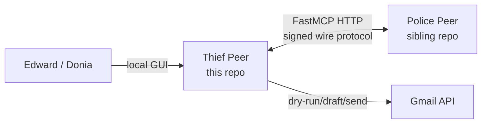
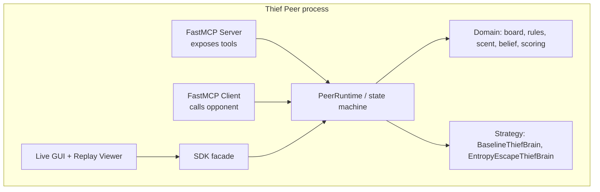
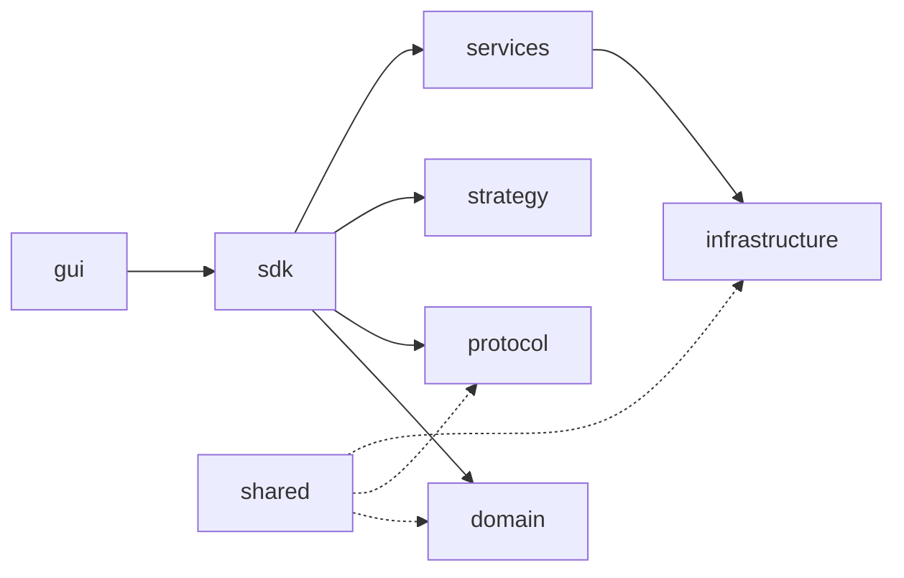
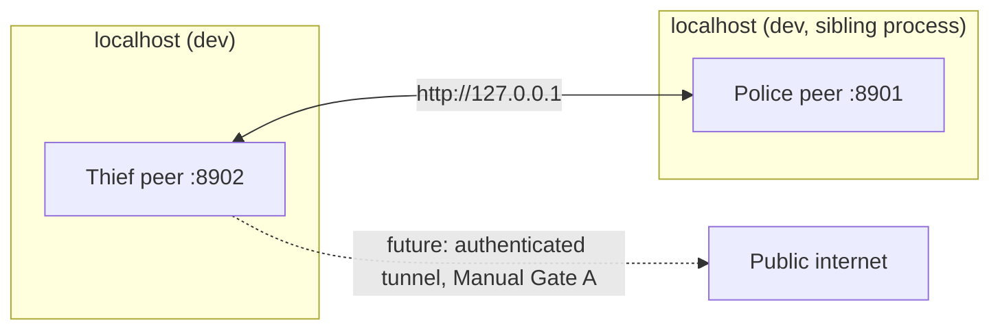
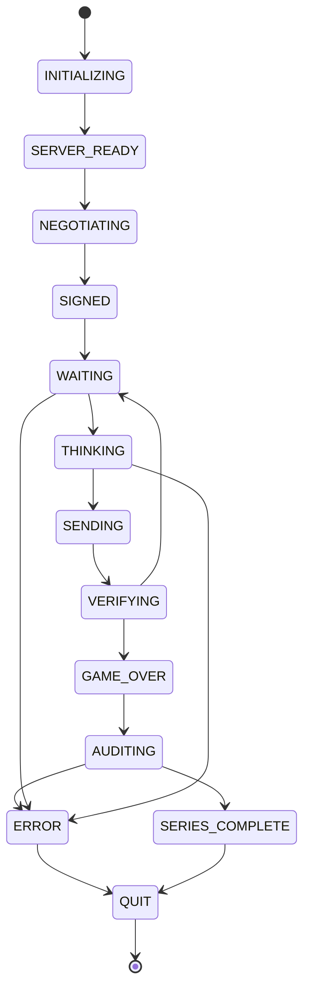
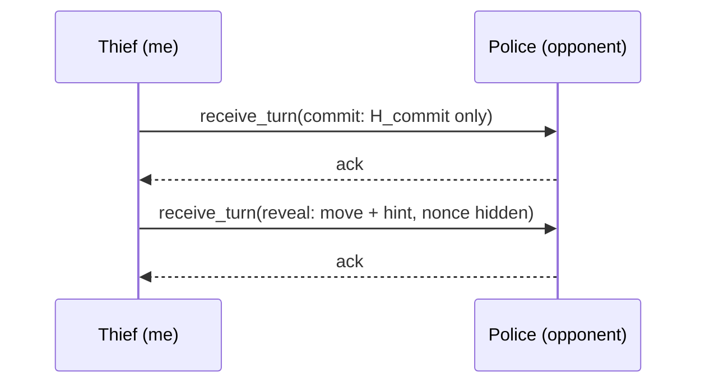
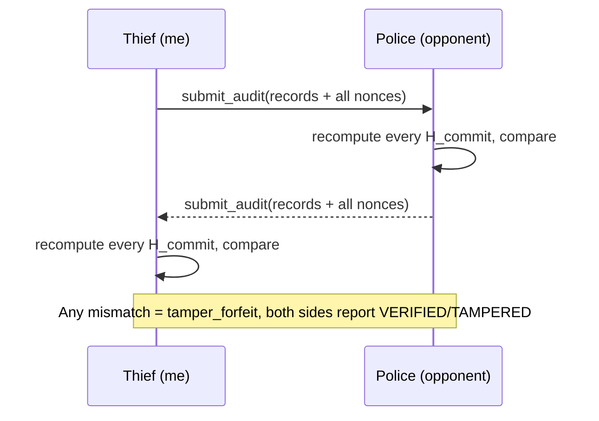

# PLAN — Thief Peer

Diagrams below are intentionally text-based (Mermaid) rather than hand-drawn images —
a real, tested live GUI and replay viewer now exist (see `screenshots/README.md` for
real manual screenshots), but Mermaid still renders in most Markdown viewers (including
GitHub) without extra tooling, so it remains the preferred format for these
architecture diagrams.

## C4 context diagram

## Container diagram

## Component diagram (this repo's `src/thief_peer/`)

## Deployment diagram

## State machine (per book Ch.8, names to be reconciled with the book's exact labels)

## Sequence diagram — one move

## Sequence diagram — commit-reveal audit (end of series)

## Threat model

See `docs/SECURITY.md` and `_post4b_supplementary_evidence/audit/risk_register.md`.

## Failure/recovery model

DeadlineTracker + Watchdog (book Ch.8.4); see `docs/ARCHITECTURE.md`.
Implemented and tested (Batch 2: `domain/deadline.py`, `domain/watchdog.py`).
Production server shutdown (a related but distinct concern -- releasing the
HTTP listening socket cleanly) was hardened in session recovery step B; see
`infrastructure/server_lifecycle.py` and the CHANGELOG.

## Data schemas

See `_post4b_supplementary_evidence/audit/protocol_contract.md` Section 5 and `PRD_commit_reveal.md`.
